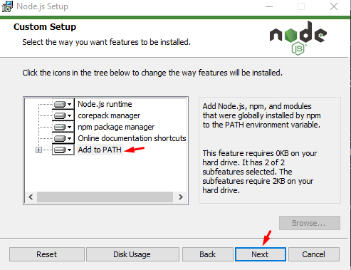

# Guía de Instalación de Node.js en Windows (Usando Instalador)

Esta guía te mostrará cómo instalar **Node.js** en Windows usando el instalador oficial.

---

## 1. Descarga del Instalador

1. Abre tu navegador web y visita la página oficial de Node.js:
   [https://nodejs.org/](https://nodejs.org/)

2. Verás dos opciones de descarga:

   - **LTS (Long Term Support)**: Recomendado para la mayoría de usuarios.
   - **Current**: Incluye las últimas funciones pero puede ser menos estable.

   Haz clic en el botón de **LTS** para descargar el instalador.

   

---

## 2. Instalación de Node.js

1. Una vez descargado, haz doble clic en el archivo `.msi` para abrir el instalador.
2. Sigue los pasos del asistente de instalación:

   - **Paso 1:** Haz clic en **Next** para continuar.

   

   - **Paso 2:** Acepta los términos de la licencia y haz clic en **Next**.

   

   - **Paso 3:** Selecciona la ubicación de instalación (puedes dejarla por defecto) y haz clic en **Next**.

   

   - **Paso 4:** Asegúrate de que la opción **Add to PATH** esté marcada y haz clic en **Next**.

   

   - **Paso 5:** Haz clic en **Install** para comenzar la instalación.

   

3. Espera a que se complete la instalación y haz clic en **Finish** cuando termine.

---

## 3. Verificar la Instalación

Para asegurarte de que Node.js se ha instalado correctamente:

1. Abre **PowerShell** o **Símbolo del sistema** (CMD).
2. Ejecuta el siguiente comando para verificar la versión de Node.js:

   ```bash
   node -v
   ```

   
