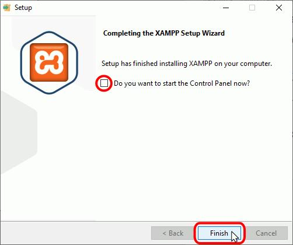

# Guía de Instalación de XAMPP

XAMPP es un paquete que incluye Apache, MySQL, PHP y Perl, lo que lo hace ideal para desarrollar sitios web en local. A continuación, te mostramos cómo instalar XAMPP en tu sistema.

## Requisitos Previos

- **Sistema operativo**: Windows, macOS o Linux
- **Conexión a Internet** (para descargar el instalador)

---

## Paso 1: Descargar XAMPP

1. Abre tu navegador web.
2. Dirígete a la página oficial de XAMPP: [https://www.apachefriends.org/es/index.html](https://www.apachefriends.org/es/index.html)
3. Haz clic en el botón correspondiente a tu sistema operativo:
   - **Windows**
   - **macOS**
   - **Linux**

El archivo de instalación se descargará automáticamente. Espera a que termine la descarga.

---

## Paso 2: Instalar XAMPP en Windows

### 1. Ejecutar el Instalador

Haz doble clic en el archivo descargado (`xampp-windows-x64-<version>.exe`) para iniciar el proceso de instalación.

### 2. Configuración del Instalador

Si aparece una advertencia de Control de cuentas de usuario (UAC), haz clic en **Sí** para permitir que el instalador haga cambios en tu PC.

En la pantalla de bienvenida, selecciona el idioma que prefieras y haz clic en **OK**.

Se abrirá el asistente de instalación. Haz clic en **Next** para continuar.

### 3. Elegir Componentes

El instalador te preguntará qué componentes deseas instalar. De manera predeterminada, XAMPP selecciona todos los componentes (Apache, MySQL, PHP, etc.), lo cual es recomendable si no tienes necesidades específicas. Puedes dejar las opciones predeterminadas o personalizar tu instalación.

Haz clic en **Next**.

### 4. Seleccionar Directorio de Instalación

Elige el directorio donde deseas instalar XAMPP (por defecto se instalará en `C:\xampp`). Si quieres cambiar la ubicación, selecciona un nuevo directorio.

Haz clic en **Next**.

### 5. Comenzar la Instalación

Haz clic en **Next** para continuar con la instalación.

Espera a que el proceso de instalación se complete. Esto puede tardar algunos minutos.

### 6. Finalizar

Cuando la instalación termine, verás una pantalla de **Completar**. Asegúrate de que la casilla "Launch XAMPP Control Panel" esté seleccionada si deseas abrir el panel de control de XAMPP inmediatamente.

Haz clic en **Finish**.

---

¡Listo! Ahora XAMPP está instalado y listo para usar en tu sistema.
