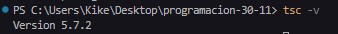
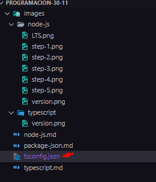
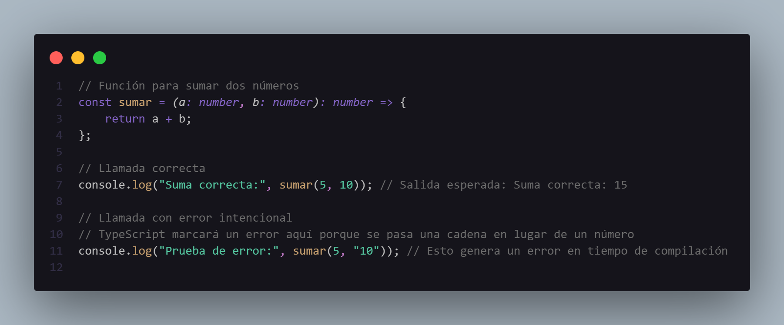
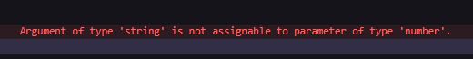

# Guía para Instalar y Configurar TypeScript en Visual Studio Code

## Requisitos Previos

1. Tener instalado **Node.js** (Incluye `npm`, el gestor de paquetes). Puedes descargarlo desde [nodejs.org](https://nodejs.org/).

2. Tener **Visual Studio Code** instalado. Descárgalo desde [code.visualstudio.com](https://code.visualstudio.com/).

---

## Paso 1: Verificar la Instalación de Node.js y npm

1. Abre una terminal (puedes usar la terminal integrada de VS Code).
2. Ejecuta los siguientes comandos para verificar que Node.js y npm están instalados correctamente:
   ```bash
   node -v
   npm -v
   ```

## Paso 2: Instalar TypeScript Globalmente

1. En la terminal, instala TypeScript de manera global ejecutando:
   ```bash
    npm install -g typescript
   ```
2. Verifica que TypeScript se instaló correctamente:

   ```bash
    tsc -v
   ```

   

## Paso 3: Configurar un Proyecto TypeScript

1. Crea un directorio para tu proyecto (si no tienes uno ya):
   ```bash
   mkdir mi-proyecto-typescript
   cd mi-proyecto-typescript
   ```
2. Inicializa TypeScript en tu proyecto: Esto generará un archivo de configuración tsconfig.json que contiene las opciones del compilador TypeScript.

   ```bash
    tsc --init
   ```

   

## Código de prueba




